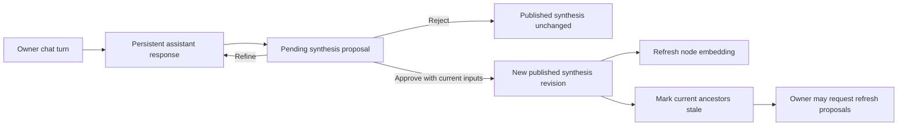

# MindTree v0.1.0 Implementation Plan

Status: Approved sequence; implementation not started

This is the temporary delivery roadmap for `SPEC.md`. It is intentionally
deleted in the final v0.1.0 release-readiness unit after all phases and evidence
gates are complete. It is not a substitute for the durable specification.

## How to use this plan

- Execute phases in order unless the user explicitly approves a revision.
- Treat each numbered phase as a proposed PR-sized unit. Split a phase before
  implementation when its debrief shows it is too large for comfortable
  review.
- Within a phase, prepare only one listed commit unit at a time. Finish its
  automated verification, independent review, approved QA, and explicit commit
  approval before implementing the next commit unit.
- Re-read `SPEC.md`, `AGENTS.md`, and `docs/session-workflow.md` at every new
  session.
- Debrief and obtain explicit approval before each phase. This plan approves the
  sequence and architecture, not unbounded implementation or publication.
- Update `SPEC.md` first when a newly approved product decision changes durable
  behavior. Keep this plan aligned while it exists.
- Use synthetic data in tests, screenshots, and live-model evaluations.
- Do not stage, commit, push, create a PR, merge, tag, release, deploy, run a
  production migration, or call a paid live model without the required
  approval boundary.

## Definition of v0.1.0

v0.1.0 is complete only when an authorized owner can organize an infinitely
nested tree, hold a persistent node conversation, generate and explicitly
approve a cited synthesis proposal, see recursive child-summary staleness,
request external research with clickable References, archive and delete
subtrees, grant a coding agent read-only access to an approved synthesis
subtree, and navigate the same tree through a responsive Node Constellation.

The release must preserve the invariant that no generated text becomes the
published synthesis without an explicit, current, transactional owner
approval.

## Approved technical baseline

### Source baseline

- [ECWireless/TimeTree](https://github.com/ECWireless/timetree) at pinned commit
  `51641ef1bc5de3e0f1d1a2ead168945d33fad47d` is the immutable source for
  MindTree's general UX, styling, stack, and repository conventions.
- Each relevant phase compares against the approved TimeTree baseline and
  records intentional MindTree divergences. `SPEC.md` remains authoritative for
  product-specific behavior, security, and data boundaries.
- Preserve TimeTree's MIT license notice and Coopa LLC attribution for adapted
  code, assets, or docs. Changing the pin requires an approved `SPEC.md` update
  and fresh divergence review.

### Application

- Next.js 16 App Router, React, strict TypeScript, and the standard Node.js
  runtime.
- pnpm with a committed lockfile and recorded package-manager version.
- Server Components for authoritative reads, Server Actions for bounded
  mutations, and a streaming route handler for chat generation.
- One versioned bearer-authenticated route exposes an explicitly allowlisted,
  read-only approved subtree to connected agents.
- Tailwind CSS plus locally owned accessible primitives and restrained global
  styles adapted from TimeTree.
- No separate API service, GraphQL, tRPC, Redux, or React Query.

### Persistence and authentication

- PostgreSQL 15+ on Neon for the canonical deployment.
- Drizzle ORM, `pg`, and reviewed Drizzle Kit SQL migrations.
- PostgreSQL `vector` extension for current-summary embeddings; exact similarity
  search initially, with no premature ANN index.
- Better Auth with Google OAuth and one normalized, verified `ALLOWED_EMAIL` per
  deployment.

### OpenAI

- Official OpenAI JavaScript SDK and Responses API.
- Interactive chat: `gpt-5.6-sol`, standard mode,
  `reasoning.effort: "high"`.
- Synthesis and web-backed proposals: `gpt-5.6-sol`,
  `reasoning.mode: "pro"`, `reasoning.effort: "high"`.
- Related-node retrieval: `text-embedding-3-large`.
- External research: Responses API `web_search`.
- No automatic fallback model and no provider abstraction in v0.1.0.
- Canonical conversations, proposals, syntheses, and citations are stored in
  PostgreSQL rather than delegated to provider-hosted conversation state.
- The model choice was verified against current official OpenAI documentation
  on 2026-08-02. Phases 6, 9, and 10 re-check current support before dependency
  or API-contract implementation because availability may change.

### Expected dependencies

Every dependency remains subject to the relevant phase debrief and lockfile
review. The expected set is:

- Runtime: `next`, `react`, `react-dom`, `better-auth`, `drizzle-orm`, `pg`,
  `zod`, `openai`, `@dnd-kit/core`, and `d3-force`.
- Rendering helpers: a small reviewed Markdown/sanitization stack and a focused
  text-diff helper only if native implementation would be less auditable.
- Development: TypeScript, ESLint with Next.js rules, Drizzle Kit, Vitest,
  Playwright, relevant type packages, Tailwind CSS, and PostCSS.

Avoid adding general agent frameworks, vector-database services, job queues,
state stores, component suites, analytics SDKs, or rich-text editors.

## Core flow



Approval never follows directly from generation. Embedding refresh may retry
after publication and does not weaken the approval transaction.

## Cross-phase invariants

Every phase that touches the relevant area preserves these rules:

1. All product rows are owner-scoped and every protected operation uses the
   centralized authorization guard.
2. Arbitrary-depth algorithms are iterative rather than recursively consuming
   the JavaScript call stack.
3. Sibling positions remain unique and contiguous under concurrent mutation.
4. Chat messages, proposals, and published syntheses are distinct persisted
   concepts.
5. Generated content cannot move the node's published synthesis pointer.
6. Approval checks its base version and exact source revisions inside the
   transaction.
7. Internal citations are limited to supplied approved evidence; external
   citations are limited to validated web-search annotations.
8. Web search is authorized for one turn at a time and is off by default.
9. Child summaries, related summaries, chats, model output, and web content are
   untrusted data.
10. Failures remain retryable without silent fallback, duplicate messages, or
    publication.
11. Logs and tracked artifacts exclude secrets, private content, prompts, raw
    provider payloads, and hidden reasoning.
12. Node Constellation stays read-only and reflects the same tree and archive
    visibility as the primary workspace.
13. An agent bearer key can read only its current subtree's approved material;
    credential management remains owner-session-only and the agent API has no
    mutation method.

## Verification commands at maturity

The scaffold will expose these commands. Early phases run the available subset;
release readiness runs all of them individually:

```bash
corepack pnpm lint
corepack pnpm typecheck
corepack pnpm test
corepack pnpm test:integration
corepack pnpm db:check
corepack pnpm build
corepack pnpm test:e2e
corepack pnpm test:eval:fixtures
```

An opt-in `test:eval:live` command is added only with hard synthetic-data and
call-count guards. It is never part of uncontrolled local or CI execution.

---

## Phase 0 — Repository contract and planning foundation

Status: Reviewed and approved for initial publication

### Goal

Create the durable product contract and working agreements before scaffolding.

### Deliverables

- `.gitignore` protects `.env` and local variants while permitting a safe
  `.env.example`.
- `SPEC.md` defines the v0.1.0 product, architecture, data boundaries, chosen
  models, approval semantics, and release definition.
- `AGENTS.md` activates the specification, temporary plan, phase debrief,
  sequential commit, verification, review, privacy, and approval workflows.
- Adapted workflow documents:
  - `docs/session-workflow.md`
  - `docs/model-effort-workflow.md`
  - `docs/pr-review-workflow.md`
  - `docs/tagging-workflow.md`
- This `IMPLEMENTATION_PLAN.md`.

### Non-goals

- No application scaffold, dependency installation, schema, provider call, or
  deployment.
- No tag or release.

### Proposed commit unit

1. `docs: define MindTree v0.1.0 product and delivery plan`

### One-time publication boundary

- Phase 0 is the first repository commit and, by explicit owner direction, is
  committed and pushed directly to `main` after final diff, commit, and push
  approval.
- No branch or pull request is created for Phase 0. Every later implementation
  unit returns to a focused conventional branch such as `feat/...`, `fix/...`,
  `docs/...`, `chore/...`, `refactor/...`, or `test/...` and the normal PR
  workflow. No `codex/` namespace is used.

### Acceptance

- The documents agree on multiple roots, archive language, persistent chat,
  explicit synthesis approval, persistent revisions, chosen models, per-turn
  web authorization, scoped read-only agent access, final-feature
  Constellation, first tag at v0.1.0, and final plan deletion.
- The exact TimeTree source repository is retained as the reference for general
  UX, styling, stack, and repository conventions, with MindTree divergences
  governed by `SPEC.md`.
- No secret or private `.env` content is read into or copied into tracked files.
- The user reviews the plan before any implementation phase begins.

### Review and verification

- Markdown links and referenced filenames are valid.
- Search for TimeTree-specific product leftovers, timer/rate language,
  contradictory model configuration, and accidental secret material.
- Two fresh-context reviewers: technical/data-integrity and security/privacy.

---

## Phase 1 — Application and test foundation

### Goal

Establish a runnable, branded, responsive Next.js foundation with no product
persistence.

Begin by inspecting the approved
[ECWireless/TimeTree](https://github.com/ECWireless/timetree) baseline for its
stack, layout, interaction density, responsive behavior, tokens, and repository
conventions. Confirm the pinned commit and record every intentional divergence
in the Phase 1 debrief.

### User-visible outcome

- A signed-out MindTree landing page with the approved dark visual direction.
- A synthetic authenticated dashboard shell can be exercised in component or
  browser fixtures without a real authentication bypass route.

### Deliverables

- Initialize `package.json` at version `0.0.0`, pnpm metadata, strict TypeScript,
  Next.js App Router, React, Tailwind/PostCSS, ESLint, and lockfile.
- Add root layout metadata, favicon/brand mark, global design tokens, landing
  state, and responsive dashboard skeleton.
- Add `.env.example` containing safe names and descriptions for database,
  Better Auth, Google OAuth, allowed email, development origins, and
  `OPENAI_API_KEY`; no model override variables in v0.1.0.
- Add environment validation that separates public and server-only values.
- Add Vitest unit configuration, PostgreSQL integration configuration seam,
  Playwright configuration, synthetic test utilities, and scripts listed in
  the maturity command set where applicable.
- Add MIT `LICENSE` and a minimal `README.md` covering requirements, safe local
  setup, verification, migrations, AI-key handling, and deployment shape.
- Adapt TimeTree's general UX and visual foundation where compatible, after
  verifying its license and preserving required attribution.

### Expected files

- `package.json`, `pnpm-lock.yaml`, framework configs, `src/app/layout.tsx`,
  `src/app/page.tsx`, `src/app/globals.css`, initial components, environment
  modules, test configs, `.env.example`, `README.md`, and `LICENSE`.

### Proposed commit units

1. `feat: establish MindTree application foundation`
2. `test: add baseline verification harness`

Split into two commits only if the first unit can pass its agreed static/build
checks independently.

### Acceptance

- Supported Node and pnpm versions are explicit.
- Signed-out UI has no page error or horizontal overflow at agreed desktop and
  narrow mobile widths.
- Keyboard focus is visible and brand controls have accessible names.
- Environment parsing rejects missing production values without exposing them.
- No auth bypass, database mutation, or OpenAI call exists.
- The implementation confirms the pinned TimeTree source baseline and explains
  intentional stack, UX, or styling deviations.

### Verification

- Lint, typecheck, unit tests, production build, and signed-out Playwright smoke.
- Dependency, privacy, accessibility, and responsive-layout review.
- One fresh-context technical/experience reviewer.

---

## Phase 2 — PostgreSQL persistence and single-owner authentication

### Goal

Create the database/authentication foundation and centralized owner boundary.

### User-visible outcome

- The configured verified Google account can enter the empty dashboard and sign
  out.
- Other, unverified, expired, or missing sessions receive safe signed-out or
  access-denied states.

### Deliverables

- Drizzle configuration, pooled application client, optional direct migration
  client selection, and initial reviewed migration.
- Better Auth user, session, account, and verification schema using its official
  Drizzle adapter.
- Google OAuth route and client/server auth helpers.
- Central authorization policy that normalizes and exactly compares the
  verified session email to the current `ALLOWED_EMAIL` on every protected
  request.
- Preview/canonical-origin behavior decided in the phase debrief without
  weakening OAuth trust.
- Synthetic integration helpers and real Better Auth browser-session fixtures;
  no application authentication bypass.

### Migration boundary

- Migration 0000 contains authentication tables only unless the debrief
  deliberately combines the first node table.
- Review account token storage and Better Auth defaults for least retention.
- Confirm local database target before applying migrations.

### Proposed commit units

1. `feat: add PostgreSQL and Better Auth foundation`
2. `test: verify MindTree authorization boundary`

### Acceptance

- Only the current configured verified identity receives dashboard data.
- A retained session stops granting access after allowlist configuration
  changes.
- Every protected read and action planned later can reuse one server guard.
- OAuth tokens and server secrets never reach client props or logs.
- Tests use synthetic identities and clean their records.

### Verification

- Schema checks, authorization unit/integration tests, lint, typecheck, build,
  and sign-in/sign-out browser tests.
- Two fresh-context reviewers: technical and security/privacy.
- User-approved local browser QA after review.

---

## Phase 3 — Ordered infinite node tree

### Goal

Implement the primary tree read model and core organization workflow without
chat or AI.

### User-visible outcome

- The owner can create multiple roots and arbitrarily deep children, expand and
  collapse branches, select linkable nodes, rename them, search by title, and
  move or reorder subtrees.
- Desktop shows tree/detail panes; mobile navigates tree to detail and back.

### Deliverables

- `nodes` schema with owner, parent, sibling position, title, archive fields,
  timestamps, and initial nullable synthesis-state fields only when required by
  migration sequencing.
- Owner/parent composite foreign key, root-aware deferrable sibling uniqueness,
  title and position checks, and self-parent check.
- Iterative flat-to-tree assembly with stable depth-first ordering,
  breadcrumbs, by-ID map, and cycle/missing-parent detection.
- Transactional create, rename, move, reorder, and subtree helpers with stable
  owner/node lock ordering and contiguous sibling rewrite.
- Server Actions with authorize-before-sensitive-validation behavior and small
  typed results.
- Dashboard toolbar, tree rows, inline creation/rename, URL selection, title
  search, breadcrumbs, drag-and-drop, and searchable **Move To…** parity.
- Deep-tree rendering that does not recursively overflow the call stack.

### Migration boundary

- Review deletion behavior carefully; product-content tables do not exist yet,
  but the parent foreign key must support subtree cascade later.
- Concurrency tests prove root and child sibling positions remain unique.

### Proposed commit units

1. `feat: add ordered owner-scoped node persistence`
2. `feat: add responsive node tree workspace`
3. `feat: add accessible node movement and search`

### Acceptance

- Multiple root nodes and unbounded product depth work.
- Selection survives browser navigation via `?node=<id>`.
- Moves cannot create cycles or cross ownership.
- Dragging before, after, and inside matches **Move To…** results.
- A deeply nested synthetic tree assembles and renders without recursive stack
  growth.
- Mobile has no hidden or unreachable core action.

### Verification

- Tree, presentation, search, and move unit tests.
- PostgreSQL ownership, concurrency, cycle, and ordering integration tests.
- Desktop/mobile Playwright workflows including deep/narrow layout.
- Two reviewers when persistence and DnD land together: technical/data and
  accessibility/experience.

---

## Phase 4 — Archive, unarchive, and permanent subtree deletion

### Goal

Add the complete non-destructive and destructive node lifecycle before nodes
contain conversation history.

### User-visible outcome

- The owner can archive a subtree, reveal archived nodes, unarchive a reachable
  path, and permanently delete a confirmed subtree.

### Deliverables

- Recursive archive implemented iteratively within an ordered-lock
  transaction.
- Unarchive selected node plus archived ancestor path, not descendants.
- **Show archived** toolbar state and preserved tree positions.
- Move/create guards preventing active nodes beneath archived destinations.
- Confirmed permanent deletion with focus management and clear irreversible
  copy.
- Stale-ancestor hooks introduced as no-ops or focused helpers if needed for
  later synthesis phases, without speculative state transitions.

### Proposed commit units

1. `feat: add node archive lifecycle`
2. `feat: add confirmed subtree deletion`

### Acceptance

- Archive and unarchive follow `SPEC.md` exactly.
- Hidden archived branches do not corrupt ordering or selected-node recovery.
- Delete removes only the authorized subtree and closes sibling position gaps.
- Dialogs restore focus, Escape behavior is safe, and pending destructive
  actions cannot be double-submitted.

### Verification

- Lifecycle unit/integration tests including ownership and concurrent moves.
- Desktop/mobile archive and delete Playwright workflows.
- Technical/data and experience review.

---

## Phase 5 — Persistent per-node chat ledger

### Goal

Establish persistent conversations and recovery states before integrating a
live model.

### User-visible outcome

- Every selected node has one persistent, paginated conversation.
- Synthetic assistant fixtures demonstrate submitted, streaming, completed,
  failed, and retry states without calling OpenAI.

### Deliverables

- `chatMessages` schema with owner/node constraints, role/status checks,
  idempotent client message IDs, provider metadata fields, web-authorization
  flag, and stable pagination index.
- Server-only paginated message read and bounded message creation/retry service.
- Chat panel, history, composer, send/pending/cancel presentation, retry UI, and
  restrained accessible streaming behavior.
- Markdown rendering boundary with an explicit allowlist and application-owned
  link handling. Select and review the smallest adequate sanitization stack.
- Deterministic in-process streaming fixture behind test-only dependency
  injection, never a runtime public bypass route.
- Selected-node workspace layout prepared for synthesis above chat without
  adding synthesis behavior yet.

### Migration boundary

- Node deletion now cascades conversation data only after the explicit delete
  confirmation transaction.
- Replay and retry tests prove one user turn is not duplicated after uncertain
  client completion.

### Proposed commit units

1. `feat: add persistent node conversations`
2. `feat: add accessible chat workspace and recovery states`

### Acceptance

- Refresh restores messages in stable order.
- Retry does not duplicate the user message.
- Switching nodes does not leak or mix conversations.
- Sanitized output cannot inject scripts, event attributes, arbitrary local
  URLs, or unsafe schemes.
- Partial token updates do not overwhelm screen-reader announcements.

### Verification

- Pagination, replay, ownership, failure-state, and sanitization tests.
- Chat persistence and responsive browser workflows with deterministic
  fixtures.
- Two reviewers: technical/data and security/accessibility.

---

## Phase 6 — OpenAI Responses API chat

### Goal

Replace the deterministic runtime fixture with the chosen OpenAI chat profile
behind a narrow, testable server boundary.

### User-visible outcome

- The owner can chat with `gpt-5.6-sol` about the selected node and see streamed
  responses persist.
- Provider errors, refusals, timeouts, disconnects, and malformed events are
  understandable and retryable.

### Deliverables

- Official `openai` SDK and centralized server-only constants for exact model
  and reasoning profiles.
- One OpenAI-specific client boundary that accepts the server-built context and
  exposes normalized streamed events. It is testable but not a general provider
  abstraction.
- Streaming chat route with owner authorization, bounded input, idempotent
  message creation, abort/disconnect handling, and persistent completion/failure
  status.
- Context builder using node identity, breadcrumb, current published synthesis
  placeholder state, and a bounded recent conversation window.
- Stable privacy-preserving `safety_identifier` and `store: false` unless the
  SDK/API contract requires a reviewed alternative.
- Prompt-injection boundary stating that node/chat content is data rather than
  instructions.
- Deterministic provider fixtures for every consumed Responses API event shape.

### Operational boundary

- `OPENAI_API_KEY` is required only for runtime AI and approved live evals, not
  static, unit, integration, or deterministic browser tests.
- No prompt or response body logging.
- No automatic fallback model.

### Proposed commit units

1. `feat: add OpenAI chat generation boundary`
2. `test: harden streamed chat failures and retries`

### Acceptance

- Runtime requests use exactly `gpt-5.6-sol`, standard mode, high effort.
- Deterministic tests cover success, refusal, SDK error, timeout, disconnect,
  duplicate retry, and malformed stream data.
- A provider failure cannot create an assistant message marked complete.
- Cancel or navigation does not publish, cross nodes, or expose hidden content.
- One separately approved synthetic live smoke proves the configured model and
  SDK contract only after deterministic review passes.

### Verification

- Static, unit, integration, provider-fixture, build, and deterministic browser
  checks.
- Two reviewers: technical/provider and security/privacy.
- Explicit user approval before the bounded live smoke and browser QA.

---

## Phase 7 — Synthesis proposals, diffs, and explicit approval

### Goal

Implement the human-published synthesis lifecycle for a single node before
recursive evidence or citations.

### User-visible outcome

- The assistant can propose a synthesis revision.
- The owner sees the current synthesis, proposal, and diff; can refine, reject,
  or approve; and sees prior approved versions remain immutable.

### Deliverables

- `synthesisVersions` schema and node current-published pointer with status,
  base version, model/reasoning profile, input fingerprint, message link, and
  decision timestamps.
- Constraint or transaction strategy for at most one current pending proposal
  and one explicit current published pointer.
- Structured model output separating ordinary assistant reply from optional
  synthesis proposal. Validate with Zod before persistence.
- Synthesis profile using `gpt-5.6-sol`, pro mode, high effort.
- Conversation-native synthesis routing without a separate proposal composer
  mode, plus a persistent Chat modal containing the transcript, composer, and
  inline pending proposal artifact with the full readable diff, reject/approve
  controls, focus/status behavior, and decided history metadata. Keep the
  published Summary as the first content section on the clean node-detail
  surface; approval closes Chat and focuses the refreshed Summary.
- Transactional approval with owner authorization, node/proposal locks, base
  pointer verification, publication pointer update, stale clear, and competing
  proposal supersession.
- Rejection and refinement state machines that never mutate decided content.

### Migration boundary

- Add the synthesis table and current pointer with a reviewed circular-reference
  strategy.
- Approved rows and citations added later must remain history-safe.
- Approval concurrency is a P1 integrity boundary and requires integration race
  tests before UI acceptance.

### Proposed commit units

1. `feat: add synthesis proposal persistence`
2. `feat: add transactional synthesis decisions`
3. `feat: add conversation-native synthesis review`

### Acceptance

- Chat generation alone cannot change the published pointer.
- Approve is the sole v0.1.0 path that publishes generated content.
- A stale-base proposal cannot be approved.
- Two concurrent approvals cannot both become current.
- Refinement creates a new immutable proposal and supersedes, rather than
  edits, the previous pending proposal.
- Rejection leaves the published synthesis unchanged.
- Natural-language drafting and refinement can create proposals but cannot
  approve, reject, or publish them.
- First-proposal diff and long-content layouts remain clear on mobile.

### Verification

- Proposal state-machine and diff unit tests.
- PostgreSQL approval/rejection/refinement ownership and race tests.
- Structured-output fixtures including absent proposal, invalid schema,
  oversized content, refusal, and malformed Markdown.
- Desktop/mobile Playwright proposal workflows.
- Two reviewers: technical/data-integrity and security/experience.

---

## Phase 8 — Recursive child synthesis and staleness

### Goal

Make approved child summaries first-class proposal evidence while preserving
manual publication at every level.

### User-visible outcome

- A parent proposal incorporates current approved direct-child syntheses.
- Approving a child makes ancestors visibly stale.
- A stale node offers **Propose refresh**, whose result still requires approval.

### Deliverables

- `synthesisInputs` table recording each child source node, nullable exact
  source synthesis version, and source-state fingerprint for every proposal.
  Children with no approved synthesis are recorded explicitly.
- Deterministic context snapshot and hash containing direct children in sibling
  order, including explicit no-synthesis states.
- Approval-time validation that every recorded input revision or explicit
  no-synthesis state is still current and the direct-child set still matches the
  proposal fingerprint.
- Iterative ancestor-path stale marking on synthesis approval.
- Stale propagation for node rename, move, archive, unarchive, and deletion
  across former/new surviving ancestor paths as specified.
- Stale badges, reason copy, and **Propose refresh** action.
- Prompt contract distinguishing published evidence from untrusted
  instructions and prohibiting unsupported child claims.

### Proposed commit units

1. `feat: add child synthesis provenance`
2. `feat: add synthesis staleness and refresh proposals`
3. `test: cover recursive synthesis integrity races`

### Acceptance

- Parent context uses only current approved child syntheses, never chat or
  pending proposals.
- Child approval does not call a model for any ancestor.
- All current ancestors become stale without losing their published synthesis.
- Approval fails if any recorded child source changed after proposal generation.
- Move marks both former and new ancestor paths stale.
- Deep ancestor propagation is iterative and owner-scoped.

### Verification

- Context/fingerprint/stale-path unit tests.
- Integration races between proposal approval and child approval, movement,
  archive, or deletion.
- Deterministic model fixtures proving child summaries are used and malicious
  child instructions are treated as data.
- Browser flow: approve leaf, observe stale parent/root, propose parent refresh,
  approve deliberately.
- Two reviewers: data-integrity and AI-security/experience.

---

## Phase 9 — Internal citations and semantic related-node retrieval

### Goal

Let proposals discover and cite relevant approved nodes beyond direct children
without allowing fabricated or cross-owner references.

### User-visible outcome

- Syntheses can contain clickable citations to exact MindTree evidence nodes.
- The owner can inspect the cited node and see when its cited revision is no
  longer current.

### Deliverables

- Enable PostgreSQL `vector` extension in a deliberate migration.
- `nodeEmbeddings` schema using `text-embedding-3-large`, exact source version,
  dimensions, owner/node constraints, and one current embedding per node.
- Post-approval embedding generation that does not roll back an already
  approved synthesis when embedding creation fails.
- Bounded exact cosine-similarity retrieval across the owner's current approved
  syntheses, excluding and deduplicating deterministic context nodes.
- `citations` schema for internal citations with nullable live target
  references, exact cited-version linkage while available, immutable
  node/title/revision snapshot fields, stable ordinal, and bounded text
  location.
- Server-created evidence aliases passed to the model; structured output cites
  aliases rather than arbitrary database UUIDs.
- Validation mapping aliases back to owner-scoped supplied evidence only.
- Application-owned citation rendering and navigation to `?node=<id>`.
- Unavailable, renamed, moved, archived, and changed-reference presentation;
  explicit deletion clears live targets but preserves citation snapshot
  metadata.
- Stale marking for current syntheses affected by relevant renamed/cited nodes.

### Migration and operational boundary

- Verify the target PostgreSQL environment supports the `vector` extension
  before migration approval.
- Start with exact search. Do not add HNSW or IVFFlat without measured need.
- Store embeddings, not raw provider request/response objects.

### Proposed commit units

1. `feat: add approved-synthesis embeddings`
2. `feat: add owner-scoped related-node retrieval`
3. `feat: add validated internal synthesis citations`

### Acceptance

- Only approved current summaries are embedded and retrieved.
- Retrieval cannot cross owners.
- Unknown, unsupplied, draft, rejected, or mismatched citation aliases reject
  the proposal safely.
- Citation links open the target node while retaining exact revision metadata.
- Embedding failure leaves publication intact and retrieval gracefully
  degraded.
- Deleting a cited node leaves an explicit unavailable-reference state in
  historical citing syntheses rather than breaking reads.

### Verification

- Embedding shape, retrieval ranking, alias mapping, citation validation, and
  References ordering unit tests.
- PostgreSQL vector ownership and lifecycle integration tests.
- Deterministic embedding and synthesis fixtures; no paid calls in normal tests.
- Browser navigation and changed/unavailable citation states.
- Two reviewers: technical/data and AI-security/privacy.
- One approved synthetic live embedding smoke after deterministic gates.

---

## Phase 10 — Explicit external web research and References

### Goal

Allow one chat turn to use external sources and carry validated citations into
an approval-required synthesis proposal.

### User-visible outcome

- The owner enables **Use web sources** for one message.
- The assistant visibly researches and returns clickable inline citations.
- A proposed synthesis contains only validated cited external claims and a
  deduplicated References section.

### Deliverables

- Per-turn web authorization in composer and server request contract; reset it
  after submission.
- Responses API `web_search` enabled only for the synthesis/research profile
  when the flag is true.
- Normalized handling of search-call state and `url_citation` annotations.
- External citation storage in the shared `citations` boundary with normalized
  HTTP(S) URL, title, ordinal, and text-location metadata.
- Visible/clickable inline citation rendering in chat and synthesis.
- References rendered from stored citation rows in first-use order with URL
  deduplication.
- Validation that rejects or de-links model-authored URLs lacking a returned
  web annotation.
- Research failure, partial result, refusal, timeout, and retry presentation.
- Clear disclosure that source links are external and may change.

### Proposed commit units

1. `feat: add explicitly authorized web research`
2. `feat: add validated external citations and references`
3. `test: harden web research failures and citation integrity`

### Acceptance

- Web search is never enabled from model initiative or prior-turn state.
- The control authorizes exactly one submitted turn.
- Every rendered external synthesis link traces to a returned web annotation.
- Inline citations are visible, clickable, accessible, and consistent with the
  References section.
- A web-backed proposal still requires explicit approval and source-version
  checks.
- Retry does not issue duplicate persisted turns or publish content.

### Verification

- Deterministic web-search event/annotation fixtures including duplicate URLs,
  invalid schemes, missing annotations, partial search, and refusal.
- Integration tests for citation constraints and owner scoping.
- Desktop/mobile browser research and References workflows using fixtures.
- Two reviewers: provider/security and experience/accessibility.
- Separately approved bounded live-web evaluation with synthetic topics and no
  private node content.

---

## Phase 11 — Integrated synthesis hardening and product polish

### Goal

Harden the complete tree-chat-synthesis workflow before adding scoped agent
access and the final Constellation feature.

### User-visible outcome

- The core workspace feels coherent, fast, recoverable, and extremely simple
  across empty, normal, long, stale, archived, failure, and narrow-screen
  states.

### Deliverables

- Context-budget policy for long chats, many children, and related-node
  candidates, with deterministic truncation that never drops required approval
  metadata.
- Pagination/load-more for chat and synthesis history as justified by actual
  layouts.
- Concurrency and uncertain-result recovery across chat, proposal generation,
  approval, movement, archive, and deletion.
- Final prompt simplification and structured schema review against
  representative fixtures.
- Accessibility pass for keyboard order, live regions, diff semantics,
  citation names, touch targets, dialog focus, and reduced motion.
- Responsive pass at agreed small mobile, mobile, tablet, and desktop widths.
- Privacy/security pass for logs, rendered Markdown, URL handling, prompt
  injection, authorization order, secrets, provider retention, and the upcoming
  agent-response allowlist boundary.
- Synthetic live-model evaluation harness with fixed fixtures, bounded calls,
  recorded structural outcomes, and manual quality rubric.
- README setup/deployment/model notes updated to match shipped behavior.

### Evaluation set

At minimum, synthetic cases cover:

1. Leaf-node idea refinement without a proposal.
2. A requested proposal requiring explicit approval.
3. Proposal refinement and rejection.
4. Parent synthesis using several child summaries.
5. Malicious instruction text inside a child summary.
6. A stale child input preventing approval.
7. Related-node discovery and exact internal citation.
8. Requested web research with supported external claims.
9. Web result containing adversarial instructions.
10. No-web turn that must not search externally.

Structural invariants—no autonomous publication, no unsupported internal IDs,
no unannotated external links, and valid output schema—must pass 100%. Quality
rubric thresholds are agreed before the approved live run rather than invented
after results are seen.

### Proposed commit units

1. `fix: harden synthesis context and recovery`
2. `fix: polish accessible responsive workspace`
3. `test: add bounded MindTree model evaluations`

### Acceptance

- All core v0.1.0 workflows pass deterministic automation.
- No P0–P2 review finding remains unresolved without explicit user disposition.
- Approved live evaluation meets its predeclared structural and quality bar.
- Core product copy makes proposal versus published synthesis unmistakable.
- The read-only agent API and final Constellation can consume the same tree read
  model without changing core synthesis behavior.

### Verification

- Full maturity command set excluding live eval by default.
- Two independent reviewers: technical/security and experience/accessibility.
- User-approved browser QA and separately approved synthetic live evaluation.

---

## Phase 12 — Scoped credential and read-only agent API

### Goal

Add TimeTree-style dynamic subtree credentials while exposing only current
approved knowledge through one read-only route.

### User-visible outcome

- An owner can create, rotate, and revoke a cryptographically protected key for
  a selected node.
- A valid key can read that node's current subtree and approved syntheses but
  cannot access chats, drafts, history, embeddings, owner data, or any mutation.

### Deliverables

- `agentApiKeys` schema with UUID selector, owner/root composite foreign key,
  unique owner/root constraint, `bytea(32)` SHA-256 digest, and creation time.
- Strict `mtk_v1.<credential UUID>.<43-character base64url secret>` generation,
  parsing, hashing, constant-time verification, and safe one-time plaintext
  return from owner actions.
- Owner-session-only create, rotate, and revoke services/actions using expected
  credential IDs and the shared stable owner/node/credential lock order.
- Central bearer-key authorization guard that rechecks the owning verified
  allowlisted identity on every request.
- Dynamic subtree resolution in one coherent transaction: the returned scope
  root has `parentId: null`; current descendants follow moves; archived nodes
  remain readable.
- A read-only `REPEATABLE READ` transaction whose first database operation
  verifies the credential and establishes the authorization/snapshot
  linearization point; movement and deletion appear wholly before or after that
  snapshot.
- Explicit agent response contracts for nodes, current approved syntheses,
  scope-filtered internal citations, and approved external References.
- Exact discriminated internal citation representations for `available`,
  `redacted`, and `unavailable`, with UTF-16 content offsets; redacted and
  unavailable states reveal no target snapshots or identity fields.
- `GET /api/agent/v1/tree` as the only agent route, with JSON, force-dynamic,
  no-store behavior and explicit allowlist serialization.
- Deterministic `405` plus `Allow: GET` for every non-GET method, including
  `HEAD` and `OPTIONS`.
- Database-side 2,000-node, 20,000-citation/Reference, and 6-MiB text preflight;
  a final 8-MiB UTF-8 JSON ceiling over the bounded materialized result; and one
  finite `413` representation for either limit stage.
- Finite safe errors that do not distinguish malformed, revoked, or
  disallowed-owner keys.
- No OpenAI call anywhere in the credential or agent-read path.

### Explicit non-goals

- No agent operation for any HTTP method other than the documented `GET`.
- No node creation, proposal submission, chat, model invocation, rename,
  movement, archive, deletion, approval, or rejection through the key.
- No raw chat, pending/rejected/superseded proposal, prior synthesis revision,
  embedding, owner, credential, or provider metadata in a response.
- No MCP server, general OAuth/API platform, per-key permissions, labels,
  expiration, last-used tracking, audit history, application-level rate
  limiter, arbitrary node lookup, search, or pagination.

### Migration and concurrency boundary

- Review the key table and composite ownership constraint before applying the
  migration.
- Credential create/rotate/revoke uses one lock order. Agent reads instead use
  the specified read-only repeatable snapshot.
- Rotation/revocation commits invalidate subsequently established snapshots;
  an earlier linearized read may finish returning its already-authorized
  snapshot.
- Moving descendants during a read cannot produce a mixed or scope-leaking
  response.

### Proposed commit units

1. `feat: add read-only agent credential foundation`
2. `feat: add scoped approved-synthesis tree API`
3. `test: harden agent scope and credential races`

### Acceptance

- Plaintext secrets are returned only at create/rotate and never stored.
- At most one current key exists per selected node; none exists after
  revocation.
- Missing, malformed, wrong, revoked, and disallowed-owner keys receive the same
  bounded unauthorized representation.
- The key reads the scope root and current descendants in stable depth-first
  order, including archived nodes.
- A moved-out descendant disappears and a moved-in node appears without leaking
  the scope root's actual parent or siblings.
- Only current approved syntheses and published References appear.
- Out-of-scope internal citations are redacted without becoming a scope oracle.
- Approved prose is returned verbatim, with the documented warning that
  structured record isolation is not semantic DLP over owner-approved text.
- No API request can mutate product or credential data.
- Oversized scopes fail at database preflight before row materialization or at
  final serialization of the already bounded result; every non-GET method
  receives the specified `405`.
- Rotation/revocation and subtree movement race tests preserve the defined
  linearization behavior.

### Verification

- Token parsing/hash unit tests and agent serialization/redaction unit tests.
- PostgreSQL credential lifecycle, dynamic scope, coherent snapshot,
  cross-owner, rotation/revocation, movement, archive, and deletion integration
  tests.
- Route tests for headers, no-store JSON, finite errors, allowlisted fields,
  node/citation/text/serialized-byte ceilings, and rejection of every non-GET
  method including `HEAD` and `OPTIONS`.
- Static checks, schema check, build, and deterministic API contract tests.
- Two independent reviewers: technical/data-integrity and security/privacy.
- No live-model evaluation or browser QA in this backend unit.

---

## Phase 13 — Agent-access dashboard and Codex setup

### Goal

Make the read-only API safely usable from the selected-node workspace and from
an explicitly connected Codex repository.

### User-visible outcome

- The owner can manage selected-node read access, copy a key once, install a
  deployment-specific Codex skill, connect a repository, and verify the
  connection without mutating MindTree.

### Deliverables

- Selected-node **Agent access** summary and modal for absent/active credential
  state.
- One-time key presentation with disabled close until the owner acknowledges
  saving it, copyable `MINDTREE_API_KEY=<key>` line, and safe clipboard failure
  fallback.
- No-store create/rotate responses and guarded in-memory secret state cleared
  on acknowledgement, navigation, reload, and `pageshow`/BFCache restoration;
  no browser storage, URL, replay, or post-dismissal recovery path.
- Expected-credential create/rotate/revoke confirmations, stale-control
  conflict reconciliation, pending-state focus management, and secret
  redaction in browser capture/logging.
- Canonical-origin and explicit-loopback validation for generated setup.
- Generated global `mindtree-node-access` skill with valid metadata, embedded
  canonical API origin, read-only response contract, dynamic scope, citation
  redaction, secret handling, no-store read behavior, and untrusted-data rules.
- Generated activation guidance that uses the skill only when the repository's
  ignored `.env` defines `MINDTREE_API_KEY` and the user asks to consult
  MindTree. Key presence alone never triggers a read.
- One-time harness setup prompt and manual fallback that contain no key,
  credential ID, or scope-root ID.
- Per-repository setup copy and a verification prompt that performs only
  `GET /tree`.
- README and `.env.example` guidance distinguishing the MindTree deployment's
  server environment from a connected repository's ignored
  `MINDTREE_API_KEY`.

### Proposed commit units

1. `feat: add read-only agent access management`
2. `feat: generate MindTree Codex node-access setup`
3. `test: verify agent credential dashboard lifecycle`

### Acceptance

- The plaintext key is visible only during the guarded one-time state and is
  absent after acknowledgement, refresh, rotation replacement, or revocation.
- Browser back/forward-cache restoration and history navigation cannot restore
  a discarded plaintext key.
- Generated skill/setup never contains the key or selected node ID.
- Repository instructions require confirming `.env` is ignored and untracked.
- The verification workflow performs only the documented read operation.
- Creating, rotating, or revoking from stale concurrent browser pages fails or
  reconciles safely without affecting a newer credential.
- Dialog focus, copy failure, long titles, mobile overflow, and secret-bearing
  capture restrictions match the privacy and accessibility boundary.

### Verification

- Unit tests for canonical origin, generated skill content, activation rules,
  and secret-free setup prompts.
- Integration tests for owner-only metadata/actions and stale expected-ID
  conflicts.
- Playwright create/copy/acknowledge/rotate/revoke and BFCache/history flows at
  desktop and mobile widths with screenshot, trace, and video disabled while
  plaintext is visible.
- Read-only connection verification against synthetic scoped data.
- Two independent reviewers: security/privacy and experience/accessibility.
- User-approved browser QA after review; no paid model call.

---

## Phase 14 — Node Constellation, the final v0.1.0 feature

### Goal

Add the read-only graphical view as the final product feature before release
readiness.

### User-visible outcome

- The owner can switch between tree and constellation, explore the same visible
  hierarchy, inspect synthesis/archive/stale state, and open a node back in the
  tree.

### Deliverables

- `d3-force` dependency and isolated deterministic graph-layout helpers.
- Toolbar constellation toggle preserving node selection and **Show archived**
  state without a new route.
- Uniform node bubbles and parent links; root blue, archived muted, stale ring,
  yellow focus/selection.
- Settling force layout, reset, pan, zoom, and local pointer/touch nudging with
  no persisted coordinates or tree mutation.
- Keyboard-focusable graph nodes with complete accessible names.
- Selection card with breadcrumb, archive state, synthesis state, and **Open in
  tree**.
- Deterministic reduced-motion layout with no continuous animation.
- Responsive empty, archived-only, mobile, and constrained-height states.

### Non-goals

- No graph editing, size metric, stored coordinates, analytics, export,
  additional route, schema, or server mutation.
- No change to proposal, citation, or approval semantics.

### Proposed commit units

1. `feat: add MindTree node constellation`
2. `test: verify constellation accessibility and responsiveness`

### Acceptance

- Constellation nodes exactly match tree archive visibility.
- Uniform sizing does not imply semantic importance.
- Opening a bubble returns to and focuses the correct tree node.
- Pan, zoom, reset, pointer/touch nudge, keyboard navigation, and reduced motion
  work at supported widths.
- The layout settles and does not consume resources indefinitely.
- Core tree editing remains the primary interface.

### Verification

- Graph derivation, visibility, styling-state, and deterministic layout unit
  tests.
- Desktop/mobile/reduced-motion Playwright workflows with touch and keyboard
  coverage.
- Performance observation on a representative synthetic tree.
- Two reviewers: technical/performance and accessibility/experience.
- User-approved browser QA.

No further product feature begins before v0.1.0. Any newly requested capability
is deferred or explicitly re-scopes the release.

---

## Phase 15 — v0.1.0 release readiness and plan retirement

### Goal

Prove the integrated release, reconcile durable documentation, remove this
temporary plan, and prepare—but do not automatically create—the first tag.

### User-visible outcome

- A reviewed v0.1.0 candidate supports the complete product definition with
  documented setup, recovery, security, and deployment behavior.

### Release-readiness tasks

1. Freeze new feature work.
2. Confirm every prior phase, accepted finding, migration, and approved QA gate
   is complete.
3. Run the complete automated suite from a clean dependency state against a
   freshly migrated synthetic database.
4. Run two integrated independent reviews:
   - technical, data-integrity, security, privacy, provider, and deployment;
   - experience, accessibility, responsive behavior, and product simplicity.
5. Resolve accepted findings sequentially and repeat affected checks/reviews.
6. Obtain approval for and run final browser QA covering:
   - sign-in/sign-out;
   - multiple roots, deep children, search, DnD, and **Move To…**;
   - persistent chat and retry;
   - proposal, diff, refinement, rejection, and approval;
   - child approval, stale ancestors, and deliberate refresh;
   - related-node internal citation navigation;
   - explicitly enabled web research, inline citations, and References;
   - archive, show archived, unarchive, and confirmed deletion;
   - agent-key creation, one-time copy, scoped subtree read, citation
     redaction, rotation, revocation, and rejected write-method probes;
   - constellation desktop, mobile, touch, keyboard, and reduced motion.
7. Obtain approval for and run the bounded synthetic live-model evaluation and
   live web citation scenario with capture configured not to retain secrets or
   private content.
8. Review migration compatibility, recovery point, abort path, environment
   inventory, OAuth callbacks, OpenAI model access, and deployment target.
9. Reconcile `README.md`, `.env.example`, `SPEC.md`, workflow documents,
   migrations, and runtime behavior. Move any approved durable operational fact
   out of this plan.
10. Confirm tracked files contain no secrets, private content, machine paths,
    raw provider payloads, screenshots with private data, or temporary eval
    artifacts.
11. Set or confirm `package.json` version `0.1.0` and lockfile consistency.
12. Delete `IMPLEMENTATION_PLAN.md` as part of the final reviewed
    release-readiness diff.

### Proposed commit units

1. `chore: complete MindTree v0.1.0 readiness fixes` when evidence produces
   necessary fixes; repeat only as separately reviewed sequential units.
2. `chore: prepare MindTree v0.1.0 release` to reconcile durable docs, set the
   version, and delete this plan after all other readiness gates pass.

The final release-preparation unit must not conceal product fixes. Material
behavior changes receive their own prior verified unit.

### Final acceptance evidence

- Exact command results for lint, typecheck, unit, integration, schema, build,
  deterministic provider, browser, and fixture evaluation suites.
- Approved live-model evaluation configuration and results using only synthetic
  data.
- Review findings and dispositions, including explicit report of no remaining
  P0–P2 issues or approved exceptions.
- Browser QA workflows, viewports, and outcomes.
- Migration and deployment checklist outcome.
- Git diff showing only intended release-readiness changes and plan deletion.
- User approval for the final release-preparation commit.

### Tag boundary

Completing and committing this phase does not authorize tagging. After the
reviewed release commit is on current `main`, follow
`docs/tagging-workflow.md` and obtain explicit approval to:

1. create annotated tag `v0.1.0`;
2. verify its target;
3. push the exact tag;
4. create a GitHub Release if desired.

The v0.1.0 tag is the first project tag.

## Deferred beyond v0.1.0

The following ideas are intentionally outside this plan unless the user later
updates `SPEC.md`:

- provider/model configurability and quality/cost routing;
- teams, sharing, public links, and collaboration;
- automatic or scheduled refresh proposals;
- notifications or background workers;
- user-editable published Markdown;
- import/export, files, images, and rich blocks;
- agent API writes, MCP, or automatic/background MindTree access;
- semantic user-facing global search;
- ANN vector indexes justified by measured scale;
- graph editing or persistent constellation coordinates;
- release versions after v0.1.0.
